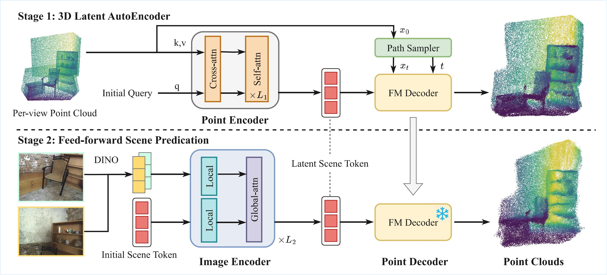

# NOVA3R - Minimal Codebase

> **This codebase is part of the [Amodal3DSeg (A3S)](https://github.com/egecimsir/nova3r-a3s) project.** 

A minimal, self-contained Python package derived from [NOVA3R](https://github.com/wrchen530/nova3r), providing the model architecture, inference pipeline, and associated utilities. Demo scripts, evaluation pipelines, benchmark datasets, and the Gradio UI are not included.

---

> *Disclaimer: Refactoring was performed with the assistance of Claude Opus 4.7 (Anthropic). The underlying model code and algorithms are derived from the upstream repository.*

---
## NOVA3R

> **NOVA3R: Non-pixel-aligned Visual Transformer for Amodal 3D Reconstruction** — Chen, Zheng, Zhang, Vedaldi, Cremers. ICLR 2026.
> [[Paper]](https://arxiv.org/abs/2603.04179) · [[Project page]](https://wrchen530.github.io/nova3r/) · [[Upstream repo]](https://github.com/wrchen530/nova3r)




**Stage 1** — A flow-matching autoencoder learns latent scene tokens from complete point clouds. **Stage 2** — A multi-view image encoder maps images into the same latent space using learnable initial tokens, trained with frozen Stage 1 decoder weights.

---

## Installation

### Requirements

| Component | Version |
|-----------|---------|
| Python | 3.10+ |
| PyTorch | 2.2+ |
| GPU (recommended) | NVIDIA with CUDA 12.1+, ≥24 GB VRAM (48 GB for the largest checkpoints) |
| Apple Silicon | Supported via MPS for inference (≥32 GB unified memory recommended) |
| CPU-only | Supported; significantly slower than GPU inference |

### Install from source

Create and activate a virtual environment. On Windows, replace the `source` line with `.venv\Scripts\activate`.

```bash
python -m venv .venv
source .venv/bin/activate
```

Install PyTorch for your platform — see the [PyTorch install picker](https://pytorch.org/get-started/locally/).

CPU / macOS-MPS:

```bash
pip install torch torchvision
```

CUDA 12.1:

```bash
pip install torch torchvision --index-url https://download.pytorch.org/whl/cu121
```

Install the package in editable mode:

```bash
pip install -e .
```

Optional extras — `[io]` installs `open3d` for PLY export; `[sampling]` installs `pytorch3d` for FPS / k-NN sampling:

```bash
pip install -e ".[io]"
pip install -e ".[sampling]"
```

### Install as a package

To use `nova3r` without cloning the repository, install it directly from Git. Create and activate a virtual environment first (see commands above), then install PyTorch for your platform, followed by:

```bash
pip install "nova3r @ git+https://github.com/<you>/nova3r-a3s.git"
```

Pin to a tag or commit for reproducibility:

```bash
pip install "nova3r @ git+https://github.com/<you>/nova3r-a3s.git@v0.1.0"
```

Installing the package also registers the `nova3r-download` command on your `PATH` (see [Checkpoints](#checkpoints)).

### Platform notes

- **`torch-cluster`** is a required dependency that ships only as a source/wheel build matching your PyTorch + CUDA version. If `pip install -e .` fails on it, install the matching wheel from the [PyG wheel index](https://data.pyg.org/whl/) first:

  ```bash
  pip install torch-cluster -f https://data.pyg.org/whl/torch-2.4.0+cu121.html
  ```

- **`pytorch3d`** has no universal PyPI wheel and is only required for the FPS / k-NN sampling paths in `nova3r.utils.sampling`. See the [pytorch3d install guide](https://github.com/facebookresearch/pytorch3d/blob/main/INSTALL.md).
- **Apple Silicon (MPS)**: inference works out of the box with `device="mps"`. Avoid CUDA-only wheels. Note that `torch-cluster` does not support MPS — tensors passing through sampling code must remain on CPU.
- **`open3d`** is required only for `save_pointcloud_ply` / `predict(output_path=...)` and is several hundred megabytes. Omit the `[io]` extra if you handle PLY serialization separately (e.g. with `plyfile`).

### Verify

```bash
python -c "import nova3r; print(nova3r.get_default_device())"
```

## Checkpoints

Checkpoints are hosted on HuggingFace and must be downloaded separately. They are stored in a directory you specify and are never placed inside the installed package.

| Model | Input | Subdirectory |
|---|---|---|
| `Nova3rPtsCond` (AE) | point cloud | `<dest>/scene_ae/` |
| `Nova3rImgCond` (N=1) | 1 image | `<dest>/scene_n1/` |
| `Nova3rImgCond` (N=2) | 2 images | `<dest>/scene_n2/` |

Each model is stored at `<dest>/<model>/checkpoint-last.pth` along with a `.hydra/config.yaml` sidecar file required by `load_model`. `<dest>` defaults to `./checkpoints`.

If the repository is gated or `HF_TOKEN` is not configured, authenticate first:

```bash
huggingface-cli login
```

Download all models to the default path:

```bash
nova3r-download
```

Download a specific model to a custom path:

```bash
nova3r-download --model scene_n1 --dest ./assets/ckpts
```

Force re-download of existing files:

```bash
nova3r-download --force
```

The same functionality is available programmatically:

```python
import nova3r
nova3r.download_checkpoints(model="scene_n1", dest="./assets/ckpts")
```

## Usage

### Quick start

`nova3r.predict` is the high-level entry point. It accepts one or two images and returns an `(N, 3)` NumPy point cloud, automatically selecting the best available device (CUDA > MPS > CPU).

```python
import nova3r

pts = nova3r.predict(
    ckpt_path="./checkpoints/scene_n1/checkpoint-last.pth",
    image_paths=["./input.png"],
    resolution=(518, 392),
    num_queries=20000,
    output_path="./output.ply",
)
print(pts.shape)
```

Supply one image for single-view or two for multi-view reconstruction. The released checkpoints expect `(width, height) = (518, 392)`. `output_path` is optional and requires the `[io]` extra.

All entry points accept a `device` argument: `None` (auto-select), a string, a `torch.device`, or a tensor. The device preference order is CUDA > MPS > CPU.

```python
import torch
import nova3r

nova3r.predict(..., device=None)
nova3r.predict(..., device="cpu")
nova3r.predict(..., device="mps")
nova3r.predict(..., device=torch.device("cuda:1"))
```

To resolve or inspect the active device explicitly:

```python
from nova3r.utils.device import get_default_device, resolve_device

device = get_default_device()
device = resolve_device("cuda:0")
device = resolve_device(some_tensor)
```

### Inference API

For fine-grained control over preprocessing, batching, or model reuse across multiple calls:

```python
from nova3r import load_model, load_images, make_pairs, inference_nova3r, save_pointcloud_ply
from nova3r.utils.device import get_default_device

device = get_default_device()

model, cfg = load_model("./checkpoints/scene_n1/checkpoint-last.pth", device=device)
model.eval()

images = load_images(["./a.png", "./b.png"], size=518)
pairs = make_pairs(images, scene_graph="complete", prefilter=None, symmetrize=False)

out = inference_nova3r(
    cfg, pairs, model, device=device,
    batch_size=1, num_queries=20000,
    method=cfg.get("fm_sampling", "euler"),
)
pts3d = out["pred"]["pts3d_xyz"][0].cpu().numpy()

save_pointcloud_ply(pts3d, "./output.ply")
```

### Manual model construction

To instantiate a model without `load_model` — for example in tests or when overriding configuration — use the model class directly with parameters from `cfg.model.params`:

```python
import torch
from omegaconf import OmegaConf
from nova3r import Nova3rImgCond, get_default_device

device = get_default_device()
cfg = OmegaConf.load("./checkpoints/scene_n1/.hydra/config.yaml").experiment

model = Nova3rImgCond(**cfg.model.params).to(device)

state = torch.load("./checkpoints/scene_n1/checkpoint-last.pth", map_location=device)
model.load_state_dict(state["model"], strict=True)
model.eval()
```

### Training

This package provides **model definitions only** — no training loop, optimizer, or dataloader. The snippet below assumes a flat-dict batch (`{str: Tensor}`); replace the `.to(device)` comprehension with a recursive helper for nested batch structures.

```python
import torch
from torch.utils.data import DataLoader
from nova3r import Nova3rImgCond
from nova3r.utils.device import get_default_device, autocast

device = get_default_device()
model = Nova3rImgCond(**your_model_params).to(device)
model.train()

opt = torch.optim.AdamW(model.parameters(), lr=1e-4, weight_decay=0.05)
loader = DataLoader(YourDataset(...), batch_size=8, shuffle=True, num_workers=4)

for batch in loader:
    batch = {k: v.to(device) for k, v in batch.items()}
    with autocast(device, dtype=torch.bfloat16):
        pred = model(batch)
        loss = your_loss_fn(pred, batch)

    opt.zero_grad(set_to_none=True)
    loss.backward()
    opt.step()
```

`model.forward(...)` returns raw predictions. Define your own loss function — for example, a Chamfer distance combined with a flow-matching velocity loss, as described in the paper.

### Public API

```python
nova3r.Nova3rImgCond
nova3r.Nova3rPtsCond
nova3r.BatchModelWrapper
nova3r.inference_nova3r(cfg, pairs, model, device, batch_size=1, num_queries=20000, method="euler")
nova3r.load_model(ckpt_path, device=None)
nova3r.predict(ckpt_path, image_paths, device=None, resolution=(518, 392), num_queries=20000, output_path=None)
nova3r.load_images(paths, size=...)
nova3r.make_pairs(images, scene_graph="complete", prefilter=None, symmetrize=False)
nova3r.save_pointcloud_ply(pts, path)
nova3r.download_checkpoints(model="all", dest="./checkpoints", repo="wrchen530/nova3r", force=False)
nova3r.get_default_device()
nova3r.resolve_device(device)
nova3r.autocast(device, dtype=None, enabled=True)
```

### Troubleshooting

- **`ModuleNotFoundError: torch_cluster`** — install the matching wheel from <https://data.pyg.org/whl/>.
- **`ImportError: save_pointcloud_ply requires open3d`** — install the `[io]` extra (`pip install -e ".[io]"`) or pass `output_path=None` and handle PLY serialization separately.
- **`FileNotFoundError: No .hydra/config.yaml found`** — the checkpoint directory is missing the Hydra configuration sidecar. Re-download with `nova3r-download --force`, or construct the model manually (see [Manual model construction](#manual-model-construction)).
- **`KeyError: Unknown model class 'X'`** — the checkpoint's `cfg.model.name` is not registered in `nova3r.io._MODEL_REGISTRY`. Only `Nova3rImgCond` and `Nova3rPtsCond` are registered by default; extend the registry for custom subclasses.
- **HuggingFace 401 / gated repository** — run `huggingface-cli login` or set the `HF_TOKEN` environment variable before invoking `nova3r-download`.
- **bf16 autocast errors on MPS** — `nova3r.utils.device.autocast` suppresses this automatically. When calling `torch.amp.autocast` directly, use `dtype=torch.float16` or disable autocast on MPS entirely.

## Package layout

```
nova3r/
  inference.py          # inference_nova3r + flow-matching glue
  io.py                 # load_images, make_pairs, save_pointcloud_ply, load_model, predict
  models/               # Nova3rImgCond, Nova3rPtsCond, BatchModelWrapper, aggregator
  heads/                # DPT head, pts3d encoder/decoder, TripoSG AE wrapper
  layers/               # transformer blocks, attention, RoPE, etc.
  flow_matching/        # paths, schedulers, ODE solver
  utils/                # device, geometry, misc, image, image_pairs, sampling
  scripts/              # download_checkpoints (nova3r-download CLI entry point)
  _vendor/
    croco/models/blocks.py
    triposg/            # vendored TripoSG package
```

## Citation

```bibtex
@inproceedings{chennova3r,
  title={NOVA3R: Non-pixel-aligned Visual Transformer for Amodal 3D Reconstruction},
  author={Chen, Weirong and Zheng, Chuanxia and Zhang, Ganlin and Vedaldi, Andrea and Cremers, Daniel},
  booktitle={The Fourteenth International Conference on Learning Representations},
  year={2026}
}
```

## License

NOVA3R is released under the Apache 2.0 license (see `LICENSE`). Vendored third-party components retain their original licenses (see `NOTICES`):
- CroCo (`nova3r/_vendor/croco/`) — CC BY-NC-SA 4.0
- TripoSG (`nova3r/_vendor/triposg/`) — MIT
- DUSt3R-derived utilities (`nova3r/utils/`) — CC BY-NC-SA 4.0
