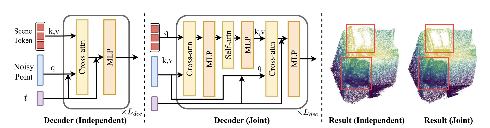

# NOVA3R — Minimal Codebase

> Part of the [Amodal3DSeg (A3S)](https://github.com/egecimsir/nova3r-a3s) project. A self-contained Python package derived from [NOVA3R](https://github.com/wrchen530/nova3r), providing the model architecture, inference pipeline, and utilities. Demo scripts, evaluation pipelines, benchmark datasets, and the Gradio UI are not included.

> *Refactoring assisted by Claude Opus 4.7 (Anthropic). Model code and algorithms are derived from the upstream repository.*

---

## About NOVA3R

> **NOVA3R: Non-pixel-aligned Visual Transformer for Amodal 3D Reconstruction** — Chen, Zheng, Zhang, Vedaldi, Cremers. ICLR 2026.
> [[Paper]](https://arxiv.org/abs/2603.04179) · [[Project page]](https://wrchen530.github.io/nova3r/) · [[Upstream repo]](https://github.com/wrchen530/nova3r)

- **Stage 1** — flow-matching autoencoder learns latent scene tokens from complete point clouds.
- **Stage 2** — multi-view image encoder maps images into the same latent space using learnable initial tokens, trained with frozen Stage 1 decoder weights.




The independent decoder uses cross-attention only; the joint decoder uses an efficient self-attention that yields more precise structures.

---

## Installation

### Requirements

| Component         | Version / Notes                                                            |
|-------------------|----------------------------------------------------------------------------|
| Python            | 3.10+                                                                       |
| PyTorch           | 2.2+ — install for your platform first (see below)                          |
| CUDA (recommended)| 12.1+, NVIDIA GPU ≥24 GB VRAM (48 GB for largest checkpoints)               |
| Apple Silicon     | macOS 13.3+, inference via MPS (≥32 GB unified memory recommended)          |
| CPU               | Supported; significantly slower                                             |

### Install PyTorch first

The package depends on `torch>=2.2` but does **not** pin a wheel index — install PyTorch yourself for your platform ([picker](https://pytorch.org/get-started/locally/)):

```bash
# CPU / macOS-MPS
pip install torch torchvision

# CUDA 12.1
pip install torch torchvision --index-url https://download.pytorch.org/whl/cu121
```

### Install nova3r

Pick **one** of the two flows below.

#### A. From source (development)

```bash
git clone https://github.com/egecimsir/nova3r-a3s.git
cd nova3r-a3s
python -m venv .venv && source .venv/bin/activate     # Windows: .venv\Scripts\activate
pip install torch torchvision                          # or the CUDA command above
pip install -e .
```

#### B. From Git URL (consumer)

```bash
python -m venv .venv && source .venv/bin/activate
pip install torch torchvision                          # or the CUDA command above
pip install "nova3r @ git+https://github.com/egecimsir/nova3r-a3s.git"
# Pin to a tag/commit for reproducibility:
# pip install "nova3r @ git+https://github.com/egecimsir/nova3r-a3s.git@v0.1.0"
```

Both flows register the `nova3r-download` CLI on your `PATH`.

#### C. Automated (script)

After cloning, [`scripts/setup.sh`](scripts/setup.sh) handles venv creation, PyTorch install, the CUDA-only `torch-cluster` wheel, and the editable install in one step. It auto-detects the host (Linux+nvcc → CUDA, macOS → MPS, else CPU) and auto-appends the `[cuda]` extra on CUDA hosts.

```bash
git clone https://github.com/egecimsir/nova3r-a3s.git
cd nova3r-a3s
bash scripts/setup.sh
source .venv/bin/activate
```

Env var overrides:

| Variable | Default | Effect |
|---|---|---|
| `PYTHON_BIN` | `python3.10` | Interpreter for a fresh venv |
| `VENV_DIR` | `.venv` | Venv path |
| `SKIP_TORCH` | `0` | Reuse the torch already in the env |
| `USE_UV` | `1` | Use `uv pip` if available; set `0` to force plain pip |
| `EXTRAS` | `io` | Comma-separated extras (`[cuda]` auto-appended on CUDA) |
| `TORCH_VERSION` / `TORCHVISION_VERSION` | `2.5.1` / `0.20.1` | Torch wheel versions |
| `CUDA_TAG` | `cu121` | Torch + PyG wheel index tag (CUDA hosts) |

Reuses an active venv if `VIRTUAL_ENV` is set, which makes it safe to delegate to from a parent setup script.

### Optional extras

| Extra        | Installs        | Required for                                                 |
|--------------|-----------------|--------------------------------------------------------------|
| `[io]`       | `open3d`        | `save_pointcloud_ply` / `predict(output_path=...)` (PLY export). |
| `[sampling]` | `pytorch3d`     | FPS / k-NN sampling in `nova3r.utils.sampling`. No universal PyPI wheel — see [pytorch3d install guide](https://github.com/facebookresearch/pytorch3d/blob/main/INSTALL.md). |
| `[cuda]`     | `torch-cluster` | Required at runtime by `Nova3rImgCond`, `Nova3rPtsCond`, and the TripoSG AE. CUDA-only; install the matching wheel from the PyG index (see below). |
| `[all]`      | all of the above | Convenience.                                                |

```bash
pip install -e ".[io]"
pip install -e ".[cuda]"
```

**`torch-cluster` install (CUDA hosts only):** the package only ships as a torch-ABI-matched wheel, so install it via the PyG index after PyTorch:

```bash
pip install torch-cluster -f https://data.pyg.org/whl/torch-2.4.0+cu121.html
```

> **macOS / CPU:** `torch-cluster` has no MPS/CPU wheel. The package installs and most code paths work; only model classes that import `torch_cluster.fps` at module top (the two `Nova3r*Cond` models, the TripoSG AE) will fail to import. Use the package's lower-level building blocks, or run on a CUDA host for end-to-end inference.

### Verify

```bash
python -c "import nova3r; print(nova3r.get_default_device())"
```

(Flow C runs this automatically at the end; on non-CUDA hosts it imports only `nova3r.io` + `nova3r.utils.device` to avoid the top-level `torch_cluster` import in the model classes.)

---

## Checkpoints

Hosted on HuggingFace; downloaded separately into a directory of your choice (default `./checkpoints`). Each model is stored at `<dest>/<model>/checkpoint-last.pth` with a `.hydra/config.yaml` sidecar required by `load_model`.

| Model                 | Input        | Subdirectory       |
|-----------------------|--------------|--------------------|
| `Nova3rPtsCond` (AE)  | point cloud  | `<dest>/scene_ae/` |
| `Nova3rImgCond` (N=1) | 1 image      | `<dest>/scene_n1/` |
| `Nova3rImgCond` (N=2) | 2 images     | `<dest>/scene_n2/` |

```bash
huggingface-cli login                                   # if HF_TOKEN not set
nova3r-download                                          # all models → ./checkpoints
nova3r-download --model scene_n1 --dest ./assets/ckpts   # one model, custom path
nova3r-download --force                                  # re-download existing files
```

Programmatic equivalent: `nova3r.download_checkpoints(model="scene_n1", dest="./assets/ckpts")`.

---

## Quick start

```python
import nova3r

pts = nova3r.predict(
    ckpt_path="./checkpoints/scene_n1/checkpoint-last.pth",
    image_paths=["./input.png"],          # 1 or 2 images
    resolution=(518, 392),                # must be multiples of 14
    num_queries=20000,
    output_path="./output.ply",           # optional; requires [io] extra
)
print(pts.shape)                          # (20000, 3)
```

Released checkpoints expect `(width, height) = (518, 392)`. `device` is auto-selected (CUDA > MPS > CPU); override with `device="cpu" | "mps" | "cuda:1" | torch.device(...)`.

For a fine-grained pipeline (preprocessing, batching, model reuse), use `load_model` + `load_images` + `make_pairs` + `inference_nova3r` + `save_pointcloud_ply` directly — see [`nova3r/io.py`](nova3r/io.py) for the full reference path.

---

## Public API

```python
# Models
nova3r.Nova3rImgCond
nova3r.Nova3rPtsCond
nova3r.BatchModelWrapper

# Pipeline
nova3r.load_model(ckpt_path, device=None)
nova3r.load_images(paths, size=...)
nova3r.make_pairs(images, scene_graph="complete", prefilter=None, symmetrize=False)
nova3r.inference_nova3r(cfg, pairs, model, device, batch_size=1, num_queries=20000, method="euler")
nova3r.predict(ckpt_path, image_paths, device=None, resolution=(518, 392), num_queries=20000, output_path=None)
nova3r.save_pointcloud_ply(pts, path)

# Checkpoints + device
nova3r.download_checkpoints(model="all", dest="./checkpoints", repo="wrchen530/nova3r", force=False)
nova3r.get_default_device()
nova3r.resolve_device(device)
nova3r.autocast(device, dtype=None, enabled=True)
```

---

## Package layout

| Path                    | What lives here                                                                 |
|-------------------------|---------------------------------------------------------------------------------|
| `nova3r/io.py`          | User-facing I/O: `load_images`, `make_pairs`, `save_pointcloud_ply`, `load_model`, `predict`. |
| `nova3r/inference.py`   | `inference_nova3r` — flow-matching ODE rollout + glue to model forward.         |
| `nova3r/models/`        | `Nova3rImgCond`, `Nova3rPtsCond`, `BatchModelWrapper`, view aggregator.         |
| `nova3r/heads/`         | DPT head, pts3d encoder/decoder, TripoSG AE wrapper.                            |
| `nova3r/layers/`        | Transformer blocks: attention, MLP, RoPE, patch embed, ViT.                     |
| `nova3r/flow_matching/` | Probability paths, schedulers, ODE solver.                                       |
| `nova3r/utils/`         | `device`, `geometry`, `image`, `image_pairs`, `sampling`, `misc`.               |
| `nova3r/scripts/`       | `download_checkpoints` — backs the `nova3r-download` CLI.                       |
| `nova3r/_vendor/`       | Vendored deps: CroCo blocks (CC BY-NC-SA 4.0), TripoSG (MIT).                   |

---

## Troubleshooting

| Symptom                                                | Fix                                                                                                                  |
|--------------------------------------------------------|----------------------------------------------------------------------------------------------------------------------|
| `ModuleNotFoundError: torch_cluster` (at `import nova3r`) | Install the matching wheel: `pip install torch-cluster -f https://data.pyg.org/whl/torch-<ver>+<cuda>.html`. CUDA host required. |
| `ImportError: save_pointcloud_ply requires open3d`     | `pip install -e ".[io]"`, or pass `output_path=None` and serialize PLY yourself.                                     |
| `FileNotFoundError: No .hydra/config.yaml found`       | Checkpoint dir missing the Hydra sidecar — re-run `nova3r-download --force`.                                         |
| `KeyError: Unknown model class 'X'`                    | Only `Nova3rImgCond` / `Nova3rPtsCond` are registered in `nova3r.io._MODEL_REGISTRY`; extend it for custom subclasses. |
| HuggingFace 401 / gated repo                           | `huggingface-cli login`, or set `HF_TOKEN`.                                                                          |
| bf16 autocast errors on MPS                            | Use `nova3r.utils.device.autocast` (suppresses bf16 on MPS) instead of calling `torch.amp.autocast` directly.        |

---

## Citation

```bibtex
@inproceedings{chennova3r,
  title={NOVA3R: Non-pixel-aligned Visual Transformer for Amodal 3D Reconstruction},
  author={Chen, Weirong and Zheng, Chuanxia and Zhang, Ganlin and Vedaldi, Andrea and Cremers, Daniel},
  booktitle={The Fourteenth International Conference on Learning Representations},
  year={2026}
}
```

## License

Apache 2.0 (see `LICENSE`). Vendored components retain their original licenses (see `NOTICES`):

- CroCo (`nova3r/_vendor/croco/`) — CC BY-NC-SA 4.0
- TripoSG (`nova3r/_vendor/triposg/`) — MIT
- DUSt3R-derived utilities (`nova3r/utils/`) — CC BY-NC-SA 4.0
